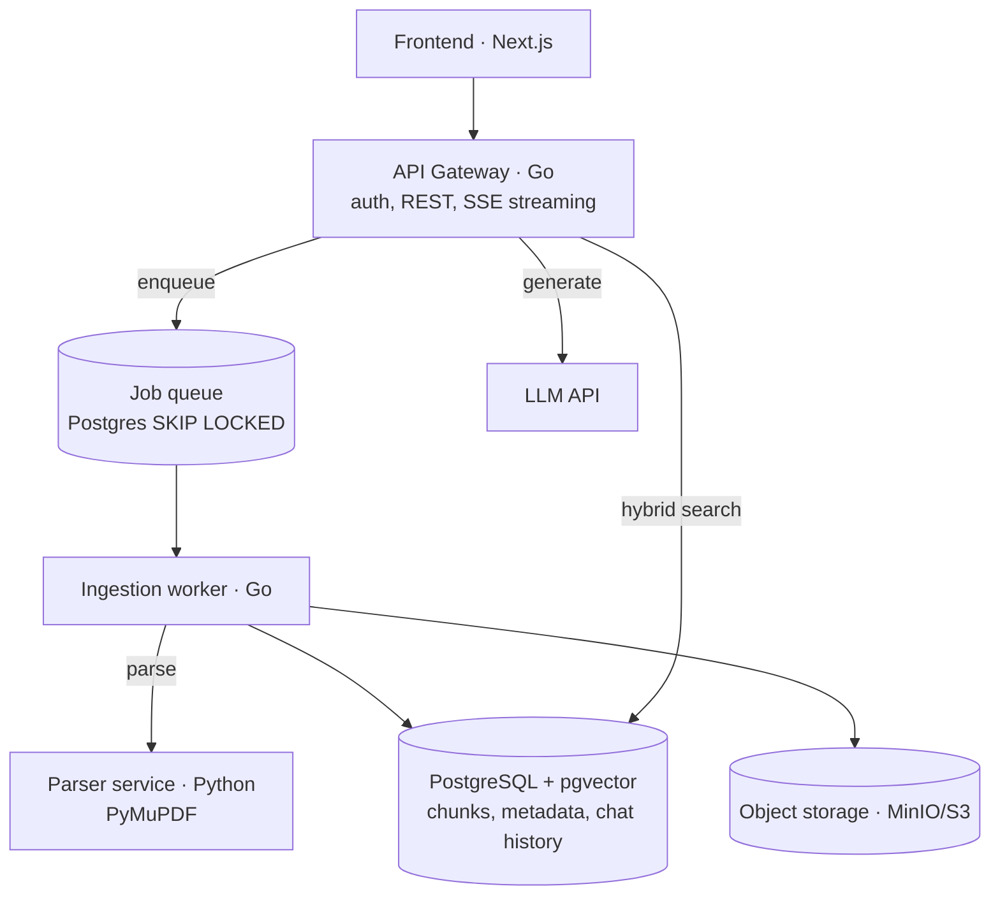

# Garden of Knowledge

A self-hosted, production-grade RAG (Retrieval-Augmented Generation) system. Upload your documents, let the pipeline parse, chunk and embed them, then have a conversation grounded in your own knowledge base — with citations pointing back to the exact source fragments.

> **Status: Phase 2 complete.** Full RAG loop: upload → parse (PDF/Markdown) → chunk → embed (voyage-4) → hybrid search (vector + full-text, RRF) → streaming chat with clickable citations, all behind a Next.js UI. See [ROADMAP](docs/ROADMAP.md).

## Architecture

The system deliberately separates the **asynchronous ingestion path** from the **synchronous query path** — the pattern that distinguishes a production RAG system from a tutorial script.



- **Go** for the API and the worker — static binaries, great concurrency, honest error handling.
- **Python** only where it earns its place: the document parsing service (the parsing/OCR ecosystem).
- **PostgreSQL + pgvector** for vectors, full-text search, metadata and the job queue — one battle-tested store instead of four moving parts ([ADR-0001](docs/adr/0001-postgres-pgvector.md), [ADR-0002](docs/adr/0002-postgres-job-queue.md)).

## Quickstart

Requirements: Docker + Docker Compose.

```bash
cp .env.example .env
make up
open http://localhost:3000    # web UI: upload, chat, citations
```

MinIO console: http://localhost:9001 · Parser API docs: http://localhost:8000/docs · API health: http://localhost:8080/readyz

For real answers set keys in `.env`: `VOYAGE_API_KEY` (embeddings; free 200M-token pool on voyage-4) and either `ANTHROPIC_API_KEY` or `OPENROUTER_API_KEY` + `LLM_MODEL` for chat. Without them the stack still runs: embeddings fall back to a deterministic fake and chat answers 503.

Without `ANTHROPIC_API_KEY` and `VOYAGE_API_KEY` set in `.env`, chat stays disabled (503) and embeddings fall back to a deterministic fake (offline-friendly, but retrieval quality is meaningless). Get a Voyage key at [dash.voyageai.com](https://dash.voyageai.com).

## Design decisions

Every non-obvious choice is documented as an ADR in [`docs/adr/`](docs/adr/). Highlights:

1. **pgvector over a dedicated vector DB** — fewer moving parts at this scale; the `VectorStore` interface keeps Qdrant swappable.
2. **Job queue in Postgres** (`SELECT … FOR UPDATE SKIP LOCKED`) instead of a message broker — transactional enqueue with the document insert, zero extra infrastructure.
3. **A separate Python parser service** — Go owns the system, Python owns the one problem it is genuinely better at.

## Repository layout

```
backend/    Go — API gateway (cmd/api) and ingestion worker (cmd/worker);
            SQL migrations embedded in internal/database/migrations
parser/     Python — document parsing service (FastAPI + PyMuPDF)
web/        Next.js frontend — upload, streaming chat, clickable citations
deploy/     Kubernetes manifests (Phase 5)
docs/       ADRs, roadmap
```

## Development

```bash
make build   # compile Go services
make test    # run tests
make lint    # go vet
make logs    # tail service logs
```

CI runs formatting checks, `go vet`, tests with the race detector, Python linting and Docker builds on every push.
